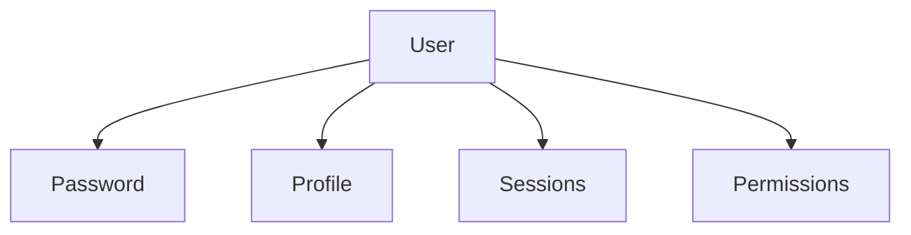
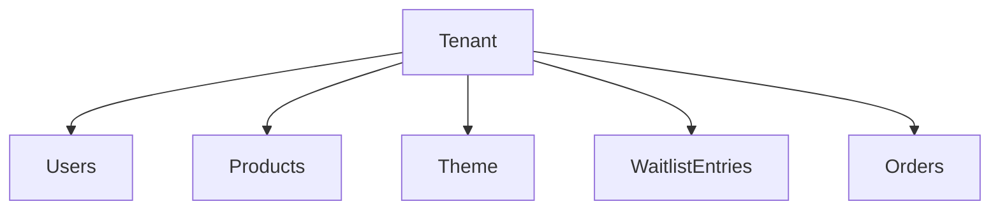
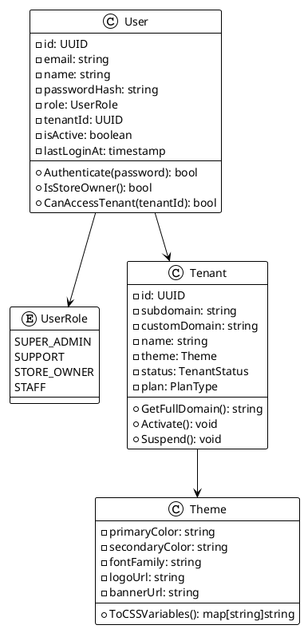

# Modelo de Domínio

## Visão Geral

O domíno do Catalog SaaS é estruturado seguindo os princípios de **Domain-Driven Design (DDD)**. Esta seção detalha as principais entidades, value objects e agregados do sistema.

## 🧩 Entidades Principais

### User (Usuário)

A entidade `User`representa um usuário do sistema, que pode ser um lojista, um funcionário ou um administrador.

#### Atributos

| Atributo | Tipo | Descrição | Exemplo |
|----------|------|-----------|---------|
| `id` | UUID | Identificador único | `123e4567-e89b-12d3-a456-426614174000` |
| `email` | string | Email do usuário (único) | `joao@loja.com` |
| `name` | string | Nome completo | `João Silva` |
| `passwordHash` | string | Hash da senha (bcrypt) | `$2a$10$...` |
| `role` | UserRole | Papel/função do usuário | `STORE_OWNER` |
| `tenantId` | UUID | Tenant ao qual pertence | `987fcdeb-...` |
| `isActive` | boolean | Se a conta está ativa | `true` |
| `lastLoginAt` | timestamp | Último login | `2026-03-05T10:30:00Z` |
| `createdAt` | timestamp | Data de criação | `2026-01-15T08:00:00Z` |
| `updatedAt` | timestamp | Última atualização | `2026-03-05T10:30:00Z` |

#### Value Objects Associados

**UserRole** (Enum)

```go
type UserRole string

const (
    RoleSuperAdmin UserRole = "super_admin" // Acesso global
    RoleSuppport UserRole = "support" // Suporte (Acesso limitado)
    RoleStoreOwner UserRole = "store_owner" // Lojista (dono da loja)
    RoleStaff UserRole = "staff" // Funcionário da loja
)
```

#### Comportamento e métodos

| Método | Descrição | Regras de Negócio |
|---|---|---|
| `IsStoreOwner()` | Verifica se é lojista	| Retorna true se role = STORE_OWNER |
| `CanAccessTenant(tenantId)` |	Verifica acesso ao tenant	| Super admin acessa todos; lojista apenas seu tenant |
| `UpdateLastLogin()` |	Atualiza timestamp de login	| Chamado após autenticação bem-sucedida|
|  `Deactivate()` |	Desativa conta	| Apenas super admin pode desativar|

#### Código de referência

```go
// internal/domain/user/entity/user.go
package entity

import (
    "time"
    "github.com/google/uuid"
    "golang.org/x/crypto/bcrypt"
)

type User struct {
    ID           uuid.UUID
    Email        string
    Name         string
    passwordHash string
    Role         UserRole
    TenantID     uuid.UUID
    IsActive     bool
    LastLoginAt  *time.Time
    CreatedAt    time.Time
    UpdatedAt    time.Time
}

func NewUser(email, name, password string, role UserRole, tenantID uuid.UUID) (*User, error) {
    // Validações de domínio
    if !isValidEmail(email) {
        return nil, ErrInvalidEmail
    }
    
    if len(password) < 8 {
        return nil, ErrPasswordTooShort
    }
    
    hash, err := bcrypt.GenerateFromPassword([]byte(password), bcrypt.DefaultCost)
    if err != nil {
        return nil, err
    }
    
    return &User{
        ID:           uuid.New(),
        Email:        email,
        Name:         name,
        passwordHash: string(hash),
        Role:         role,
        TenantID:     tenantID,
        IsActive:     true,
        CreatedAt:    time.Now(),
        UpdatedAt:    time.Now(),
    }, nil
}

func (u *User) Authenticate(password string) bool {
    err := bcrypt.CompareHashAndPassword([]byte(u.passwordHash), []byte(password))
    return err == nil
}
```

### Tenant (Cliente/Loja)

A entidade `Tenant` representa uma loja/cliente da plataforma.

#### Atributos Principais

| Atributo |	Tipo |	Descrição |
|---|---|---|
| id |	UUID |	Identificador único |
| subdomain |	string	Subdomínio da loja (ex: loja123) |
| customDomain |	string	Domínio próprio (opcional) |
| name |	string |	Nome da loja |
| theme |	Theme |	Configurações visuais (cores, fontes, logo) |
| status |	TenantStatus |	Ativo, suspenso, provisionando |
| plan |	PlanType |	Plano contratado |

```go
type Theme struct {
    PrimaryColor   string
    SecondaryColor string
    FontFamily     string
    LogoURL        string
    BannerURL      string
}
```

## Agregados

### Aggregate: User

O agregado `User` é a raiz para todas a operações relacionadas a usuários.



### Agreate: Tenant

O agregado `Tenant` agrupa todas as entidades pertencentes a uma loja



## Diagrama de Classes



## Invariantes e Regras de Negócio

- **Email único por tenant:** Não pode haver dois usuários com o mesmo email no mesmo tenant.
- **Senha forte:** Mínimo 8 caracteres, utilizando `bcrypt` como método de criptografia padrão.
- **Primeiro Usuário:** Ao criar um tenant, o primeiro usuári é automaticamente `STORE_OWNER`.
- **Isolamento:** Usuários só acessam dados do seu próprio tenant.
- **Autenticação:** Após 5 tentativas falhas,  conta é temporariamente bloqueada.