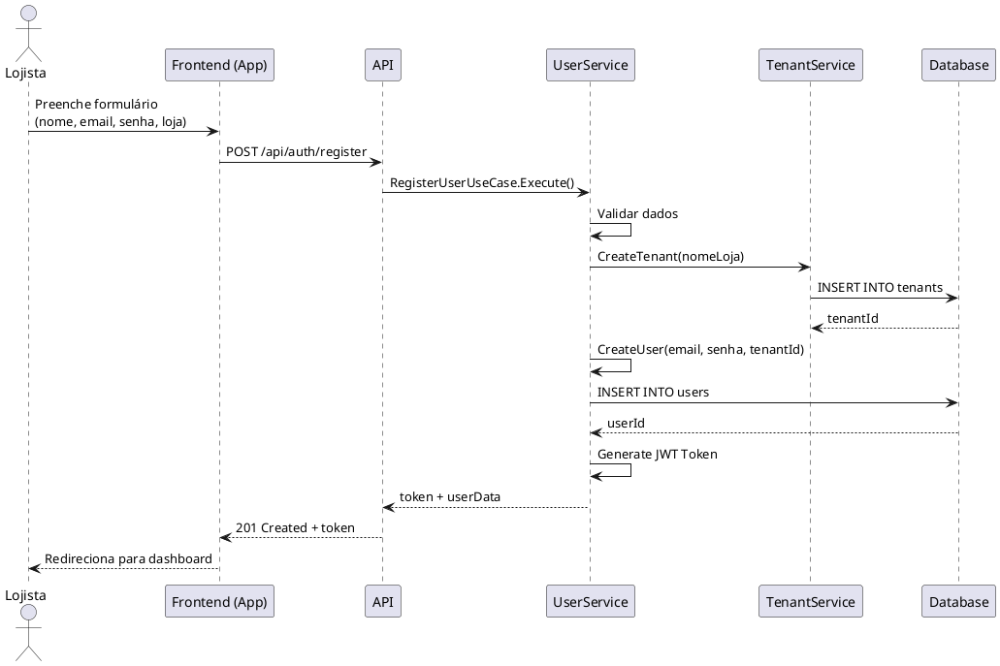
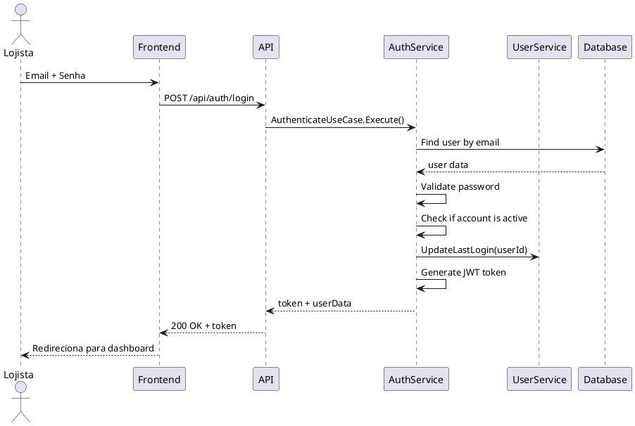

# Casos de Uso: Cadastro e Login

## 📝 Cadastro de Usuário (Lojista)

### Visão Geral

O fluxo de cadastro permite que novos lojistas criem sua conta na plataforma. Este processo inclui a criação do tenant (loja) e do primeiro usuário administrador.

### Diagrama de sequência



### Requisição HTTP

#### Endpoint: `POST /api/auth/register`

**Headers:**

```bash
Content-Type: application/json
```

**Body:**

```json
{
  "name": "João Silva",
  "email": "joao@minhaloja.com",
  "password": "SenhaForte123!",
  "storeName": "Minha Loja Online",
  "storeSubdomain": "minhaloja",  // opcional
  "planType": "basic"               // basic, pro, enterprise
}
```

**Resposta de Sucesso (201):**

```json
{
  "success": true,
  "data": {
    "user": {
      "id": "123e4567-e89b-12d3-a456-426614174000",
      "name": "João Silva",
      "email": "joao@minhaloja.com",
      "role": "store_owner"
    },
    "tenant": {
      "id": "987fcdeb-51a2-12d3-a456-426614174000",
      "name": "Minha Loja Online",
      "subdomain": "minhaloja.catalogosaas.com",
      "status": "provisioning"
    },
    "token": "eyJhbGciOiJIUzI1NiIsInR5cCI6IkpXVCJ9..."
  },
  "message": "Cadastro realizado com sucesso! Verifique seu email para ativar a conta."
}
```

**Resposta de Erro (400):**

```json
{
  "success": false,
  "error": {
    "code": "VALIDATION_ERROR",
    "message": "Dados inválidos",
    "details": [
      {
        "field": "email",
        "message": "Email já cadastrado"
      },
      {
        "field": "password",
        "message": "Senha deve ter no mínimo 8 caracteres"
      }
    ]
  }
}
```

### Regras de Negócio

| Campo | Regra | Código de Erro |
|---|---|---|
| `email` | Formato válido e único na plataforma | `EMAIL_INVALID`/`EMAIL_ALREADY_EXISTS` |
| `password` | Mínimo 8 caracteres, 1 letra maiúscula e 1 número | `WEAK_PASSWORD` |
| `storeName` | Mínimo 3 caracteres | `INVALID_STORE_NAME` |
| `storeSubdomain` | Apenas letras minúsculas, números e hífens | `INVALID_SUBDOMAIN` |

## 🔐 Login de Usuário

### Visão Geral

O fluxo de login autentica o usuário e retorna um token JWT para acesso às rotas protegidas.
Diagrama de Sequência.



### Requisição HTTP

#### Endpoint: `POST /api/auth/login`

**Headers:**

```bash
Content-Type: application/json
```

**Body:**

```json
{
  "email": "joao@minhaloja.com",
  "password": "SenhaForte123!",
  "rememberMe": true  // opcional, aumenta expiração do token
}
```

**Resposta de Sucesso (200):**

```json
{
  "success": true,
  "data": {
    "token": "eyJhbGciOiJIUzI1NiIsInR5cCI6IkpXVCJ9...",
    "expiresIn": 86400,  // segundos (24h)
    "user": {
      "id": "123e4567-e89b-12d3-a456-426614174000",
      "name": "João Silva",
      "email": "joao@minhaloja.com",
      "role": "store_owner",
      "tenant": {
        "id": "987fcdeb-51a2-12d3-a456-426614174000",
        "name": "Minha Loja Online",
        "subdomain": "minhaloja"
      }
    }
  }
}
```

**Resposta de Erro (401):**

```json
{
  "success": false,
  "error": {
    "code": "INVALID_CREDENTIALS",
    "message": "Email ou senha inválidos"
  }
}
```

## Autenticação e Autorização

### JWT Token

O token JWT contém as seguintes claims:

```json
{
  "sub": "123e4567-e89b-12d3-a456-426614174000",  // user_id
  "email": "joao@minhaloja.com",
  "role": "store_owner",
  "tenant_id": "987fcdeb-51a2-12d3-a456-426614174000",
  "permissions": ["products:read", "products:write", "waitlist:manage"],
  "iat": 1741219200,  // issued at
  "exp": 1741305600   // expiration
}
```

### Middleware de Autenticação

```go
// internal/infrastructure/web/middleware/auth.go
func AuthMiddleware() gin.HandlerFunc {
    return func(c *gin.Context) {
        token := extractToken(c)
        
        claims, err := validateToken(token)
        if err != nil {
            c.JSON(401, gin.H{"error": "Unauthorized"})
            c.Abort()
            return
        }
        
        // Adiciona informações ao contexto
        c.Set("userID", claims.Subject)
        c.Set("tenantID", claims.TenantID)
        c.Set("userRole", claims.Role)
        
        c.Next()
    }
}
```

### Níveis de Acesso

|Rota |	Método |	Acesso |	Descrição  |
|---|---|---|---|
|/api/auth/register |	POST	| Público |	Cadastro |
|/api/auth/login |	POST	| Público |	Login |
|/api/auth/logout |	POST	| Autenticado |	Logout |
|/api/users/me |	GET	| Autenticado |	Perfil |
|/api/tenants/:id |	GET	| STORE_OWNER, SUPPORT |	Dados do tenant |
|/api/admin/* |	*	| SUPER_ADMIN |	Rotas administrativa |

#### Exemplos de Implementação

```go
// internal/application/auth/usecases/register_user.go
package usecases

type RegisterUserInput struct {
    Name        string
    Email       string
    Password    string
    StoreName   string
    Subdomain   string
    PlanType    string
}

type RegisterUserOutput struct {
    User  *entity.User
    Token string
}

type RegisterUserUseCase struct {
    userRepo   repository.UserRepository
    tenantRepo repository.TenantRepository
    hasher     security.PasswordHasher
    tokenGen   security.TokenGenerator
}

func (uc *RegisterUserUseCase) Execute(ctx context.Context, input RegisterUserInput) (*RegisterUserOutput, error) {
    // 1. Validar email único
    exists, err := uc.userRepo.EmailExists(ctx, input.Email)
    if err != nil {
        return nil, err
    }
    if exists {
        return nil, errors.New("email already exists")
    }
    
    // 2. Criar tenant
    tenant, err := entity.NewTenant(input.StoreName, input.Subdomain, input.PlanType)
    if err != nil {
        return nil, err
    }
    
    if err := uc.tenantRepo.Save(ctx, tenant); err != nil {
        return nil, err
    }
    
    // 3. Criar usuário
    user, err := entity.NewUser(input.Name, input.Email, input.Password, entity.RoleStoreOwner, tenant.ID)
    if err != nil {
        return nil, err
    }
    
    if err := uc.userRepo.Save(ctx, user); err != nil {
        return nil, err
    }
    
    // 4. Gerar token
    token, err := uc.tokenGen.Generate(user.ID.String(), user.Role, tenant.ID.String())
    if err != nil {
        return nil, err
    }
    
    return &RegisterUserOutput{
        User:  user,
        Token: token,
    }, nil
}
```
#### Frontend (HTMX - Exemplo de formulário)

```html
<!-- fragments/auth/register-form.html -->
<form hx-post="/api/auth/register" 
      hx-target="#result"
      hx-swap="innerHTML"
      class="register-form">
    
    <div class="form-group">
        <label for="name">Nome completo</label>
        <input type="text" id="name" name="name" required 
               minlength="3" maxlength="100">
    </div>
    
    <div class="form-group">
        <label for="email">Email</label>
        <input type="email" id="email" name="email" required>
    </div>
    
    <div class="form-group">
        <label for="password">Senha</label>
        <input type="password" id="password" name="password" required 
               minlength="8">
        <small>Mínimo 8 caracteres</small>
    </div>
    
    <div class="form-group">
        <label for="storeName">Nome da loja</label>
        <input type="text" id="storeName" name="storeName" required>
    </div>
    
    <button type="submit">Criar conta</button>
</form>

<div id="result"></div>
```

#### 🧪 Testes

##### Testes de Unidade

```go
// internal/domain/user/entity/user_test.go
func TestUser_Authenticate(t *testing.T) {
    user, _ := NewUser("João", "joao@email.com", "Senha123!", RoleStoreOwner, tenantID)
    
    tests := []struct {
        name     string
        password string
        want     bool
    }{
        {"Senha correta", "Senha123!", true},
        {"Senha incorreta", "senhaerrada", false},
        {"Senha vazia", "", false},
    }
    
    for _, tt := range tests {
        t.Run(tt.name, func(t *testing.T) {
            if got := user.Authenticate(tt.password); got != tt.want {
                t.Errorf("Authenticate() = %v, want %v", got, tt.want)
            }
        })
    }
}
```

##### Testes de Integração

```go
// internal/application/auth/usecases/register_user_test.go
func TestRegisterUserUseCase_Execute(t *testing.T) {
    // Setup
    db := setupTestDB(t)
    defer db.Close()
    
    userRepo := postgres.NewUserRepository(db)
    tenantRepo := postgres.NewTenantRepository(db)
    
    useCase := NewRegisterUserUseCase(userRepo, tenantRepo, bcryptHasher, jwtGenerator)
    
    // Test
    input := RegisterUserInput{
        Name:      "João Silva",
        Email:     "joao@teste.com",
        Password:  "Senha123!",
        StoreName: "Loja Teste",
        PlanType:  "basic",
    }
    
    output, err := useCase.Execute(context.Background(), input)
    
    assert.NoError(t, err)
    assert.NotNil(t, output.Token)
    assert.Equal(t, input.Email, output.User.Email)
}
```

#### 📊 Métricas e Monitoramento

Eventos de autenticação são registrados no Loki e métricas no Prometheus:

```go
// Métricas coletadas
authRegisterAttempts := promauto.NewCounterVec(
    prometheus.CounterOpts{
        Name: "auth_register_attempts_total",
        Help: "Total de tentativas de cadastro",
    },
    []string{"status"}, // success, failure
)

authLoginAttempts := promauto.NewCounterVec(...)
authActiveSessions := promauto.NewGauge(...)
```

#### Logs Estruturados

```json
{
  "level": "info",
  "service": "catalog-backend",
  "component": "auth",
  "timestamp": "2026-03-05T10:30:00Z",
  "message": "User registered successfully",
  "tenant_id": "987fcdeb...",
  "user_id": "123e4567...",
  "email": "joao@minhaloja.com",
  "ip": "192.168.1.100",
  "user_agent": "Mozilla/5.0..."
}
```

### Considerações de Segurança

- **Senhas:** Armazenadas com bcrypt (custo 12)

- **Tokens JWT:** Assinados com HS256, expiração de 24h

- **Rate Limiting:** 5 tentativas de login por minuto

- **HTTPS:** Obrigatório em produção

- **Headers de Segurança:** HSTS, CSP, X-Frame-Options

- **Auditoria:** Todas as ações são logadas